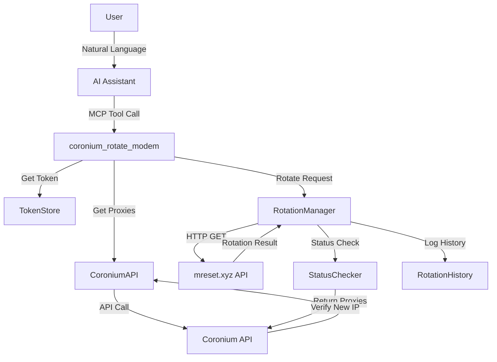
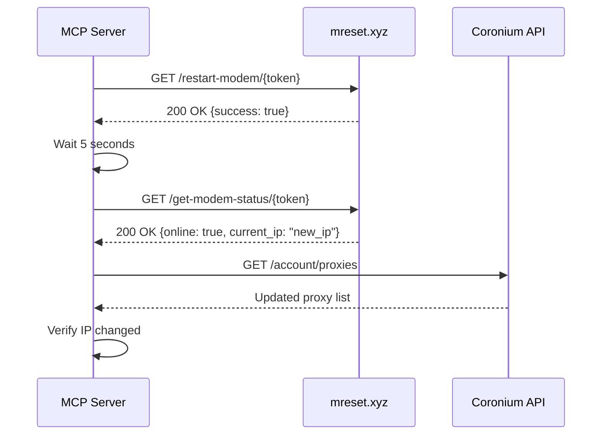

# Rotate Modem Feature - Architecture & Implementation Plan

## Executive Summary

This document outlines the architecture and implementation plan for adding a "Rotate Modem" feature to the Coronium MCP server. This feature will allow AI assistants to programmatically rotate proxy IP addresses through simple natural language commands.

---

## 1. Feature Overview

### Purpose
Enable users to rotate their proxy IPs directly through AI commands without manual intervention or dashboard access.

### Key Capabilities
- Rotate single proxy by name or ID
- Rotate multiple proxies at once
- Check rotation status
- Smart retry with exponential backoff
- Rotation history tracking
- Automatic status verification post-rotation

### User Experience
```
User: "Rotate my US proxy"
AI: "I'll rotate your US proxy now..."
AI: "✅ Successfully rotated cor_US_41f8d8ff52eecd18ce695f3649156cef
     Old IP: 172.56.171.66
     New IP: 172.56.171.89
     Rotation completed in 8.2 seconds"
```

---

## 2. Technical Architecture

### 2.1 System Components



### 2.2 New Classes to Implement

#### RotationManager Class
```typescript
class RotationManager {
  private client: AxiosInstance;
  private maxRetries: number = 3;
  private retryDelay: number = 5000;

  constructor() {
    this.client = axios.create({
      timeout: 30000,
      validateStatus: (status) => status < 500
    });
  }

  async rotateProxy(proxy: ProxyInfo): Promise<RotationResult>
  async checkStatus(statusUrl: string): Promise<ProxyStatus>
  async waitForRotation(proxy: ProxyInfo): Promise<boolean>
  private async retryWithBackoff(fn: Function, retries: number): Promise<any>
}
```

#### RotationHistory Class
```typescript
class RotationHistory {
  private historyFile: string;
  private maxEntries: number = 100;

  async addRotation(entry: RotationEntry): Promise<void>
  async getHistory(proxyId?: string): Promise<RotationEntry[]>
  async getLastRotation(proxyId: string): Promise<RotationEntry | null>
  private pruneOldEntries(): void
}
```

### 2.3 Data Structures

#### RotationResult
```typescript
interface RotationResult {
  success: boolean;
  proxyId: string;
  proxyName: string;
  oldIp: string;
  newIp?: string;
  rotationTime: number; // milliseconds
  timestamp: number;
  error?: string;
  statusUrl?: string;
}
```

#### ProxyStatus
```typescript
interface ProxyStatus {
  online: boolean;
  currentIp: string;
  uptime?: number;
  lastRotation?: string;
  carrier?: string;
  signal?: number;
}
```

#### RotationEntry
```typescript
interface RotationEntry {
  id: string;
  proxyId: string;
  proxyName: string;
  oldIp: string;
  newIp: string;
  timestamp: number;
  duration: number;
  success: boolean;
  error?: string;
}
```

---

## 3. Implementation Plan

### Phase 1: Core Rotation Functionality (Priority: HIGH)

#### Task 1.1: Create RotationManager Class
**File:** `src/server.ts` (lines 280-450, new section)
```typescript
// Add after CoroniumAPI class

class RotationManager {
  private client: AxiosInstance;
  private logger: Logger;

  constructor(logger: Logger) {
    this.logger = logger;
    this.client = axios.create({
      timeout: 30000,
      headers: {
        'User-Agent': 'Coronium-MCP-Server/1.0'
      }
    });
  }

  async rotateProxy(proxy: any): Promise<RotationResult> {
    const startTime = Date.now();
    const oldIp = proxy.ext_ip;

    try {
      // Use restartByToken URL directly
      if (!proxy.restartByToken) {
        throw new Error('No rotation token available for this proxy');
      }

      this.logger.info(`Rotating proxy ${proxy.name}...`);
      const response = await this.client.get(proxy.restartByToken);

      // Wait for rotation to complete
      await this.wait(5000); // Initial wait

      // Check new status
      const status = await this.checkStatus(proxy.statusByToken);

      return {
        success: true,
        proxyId: proxy._id,
        proxyName: proxy.name,
        oldIp: oldIp,
        newIp: status.currentIp,
        rotationTime: Date.now() - startTime,
        timestamp: Date.now()
      };
    } catch (error) {
      this.logger.error(`Rotation failed for ${proxy.name}:`, error);
      return {
        success: false,
        proxyId: proxy._id,
        proxyName: proxy.name,
        oldIp: oldIp,
        rotationTime: Date.now() - startTime,
        timestamp: Date.now(),
        error: error.message
      };
    }
  }

  async checkStatus(statusUrl: string): Promise<ProxyStatus> {
    try {
      const response = await this.client.get(statusUrl);
      return {
        online: response.data.online || true,
        currentIp: response.data.current_ip || response.data.ip,
        uptime: response.data.uptime,
        lastRotation: response.data.last_rotation
      };
    } catch (error) {
      this.logger.warn('Status check failed:', error);
      return {
        online: false,
        currentIp: 'unknown'
      };
    }
  }

  private async wait(ms: number): Promise<void> {
    return new Promise(resolve => setTimeout(resolve, ms));
  }
}
```

#### Task 1.2: Add Input Validation Schema
**File:** `src/server.ts` (line 516, after existing schemas)
```typescript
const RotateModemArgsSchema = z.object({
  proxy_identifier: z.string().optional(), // Name, ID, or country
  all: z.boolean().optional(), // Rotate all proxies
  wait_for_completion: z.boolean().optional().default(true),
  max_wait_time: z.number().optional().default(30000) // 30 seconds default
});
```

#### Task 1.3: Register MCP Tool
**File:** `src/server.ts` (line 990, after last tool registration)
```typescript
server.tool(
  "coronium_rotate_modem",
  "🔄 Rotates the IP address of your mobile proxy. Can rotate by name, country (e.g., 'US'), or rotate all proxies. Requires authentication.",
  async (args: any) => {
    // Implementation below
  }
);
```

---

### Phase 2: Enhanced Features (Priority: MEDIUM)

#### Task 2.1: Implement Rotation History
**File:** `src/server.ts` (lines 450-520, new section)
```typescript
class RotationHistory {
  private historyDir: string;
  private historyFile: string;
  private logger: Logger;

  constructor(logger: Logger) {
    this.logger = logger;
    this.historyDir = path.join(os.homedir(), '.coronium');
    this.historyFile = path.join(this.historyDir, 'rotation_history.json');
    this.ensureHistoryFile();
  }

  private ensureHistoryFile(): void {
    if (!fs.existsSync(this.historyFile)) {
      fs.writeFileSync(this.historyFile, '[]', 'utf8');
    }
  }

  async addRotation(entry: RotationEntry): Promise<void> {
    try {
      const history = this.getHistory();
      history.push(entry);

      // Keep only last 100 entries
      const pruned = history.slice(-100);

      fs.writeFileSync(this.historyFile, JSON.stringify(pruned, null, 2));
    } catch (error) {
      this.logger.warn('Failed to save rotation history:', error);
    }
  }

  getHistory(proxyId?: string): RotationEntry[] {
    try {
      const data = fs.readFileSync(this.historyFile, 'utf8');
      const history = JSON.parse(data);

      if (proxyId) {
        return history.filter(e => e.proxyId === proxyId);
      }

      return history;
    } catch {
      return [];
    }
  }
}
```

#### Task 2.2: Add Batch Rotation Support
```typescript
async function rotateMultipleProxies(
  proxies: any[],
  rotationManager: RotationManager
): Promise<RotationResult[]> {
  // Parallel rotation with concurrency limit
  const concurrencyLimit = 3;
  const results: RotationResult[] = [];

  for (let i = 0; i < proxies.length; i += concurrencyLimit) {
    const batch = proxies.slice(i, i + concurrencyLimit);
    const batchResults = await Promise.all(
      batch.map(proxy => rotationManager.rotateProxy(proxy))
    );
    results.push(...batchResults);
  }

  return results;
}
```

#### Task 2.3: Smart Proxy Selection
```typescript
function findProxyByIdentifier(proxies: any[], identifier: string): any[] {
  const lowerIdentifier = identifier.toLowerCase();

  // Check if it's a country code
  const countryProxies = proxies.filter(p =>
    p.name.toLowerCase().includes(`_${lowerIdentifier}_`)
  );
  if (countryProxies.length > 0) return countryProxies;

  // Check by exact name
  const namedProxy = proxies.filter(p =>
    p.name.toLowerCase() === lowerIdentifier
  );
  if (namedProxy.length > 0) return namedProxy;

  // Check by ID
  const idProxy = proxies.filter(p => p._id === identifier);
  if (idProxy.length > 0) return idProxy;

  // Partial match
  return proxies.filter(p =>
    p.name.toLowerCase().includes(lowerIdentifier)
  );
}
```

---

### Phase 3: Tool Implementation (Priority: HIGH)

#### Task 3.1: Complete Tool Handler
```typescript
server.tool(
  "coronium_rotate_modem",
  "🔄 Rotates the IP address of your mobile proxy. Can rotate by name, country (e.g., 'US'), or rotate all proxies. Requires authentication.",
  async (args: any) => {
    const parsed = RotateModemArgsSchema.safeParse(args);
    if (!parsed.success) {
      return {
        content: [{
          type: "text",
          text: `❌ Invalid input: ${parsed.error.errors.map(e => e.message).join(", ")}`
        }]
      };
    }

    // Check authentication
    const token = tokenStore.get();
    if (!token) {
      return {
        content: [{
          type: "text",
          text: "❌ No authentication token found. Please run coronium_get_token first."
        }]
      };
    }

    try {
      // Get current proxies
      const proxies = await api.getProxies(token);
      if (!proxies || proxies.length === 0) {
        return {
          content: [{
            type: "text",
            text: "❌ No proxies found in your account."
          }]
        };
      }

      // Initialize managers
      const rotationManager = new RotationManager(logger);
      const history = new RotationHistory(logger);

      // Determine which proxies to rotate
      let targetProxies: any[] = [];

      if (parsed.data.all) {
        targetProxies = proxies;
      } else if (parsed.data.proxy_identifier) {
        targetProxies = findProxyByIdentifier(proxies, parsed.data.proxy_identifier);
        if (targetProxies.length === 0) {
          return {
            content: [{
              type: "text",
              text: `❌ No proxy found matching "${parsed.data.proxy_identifier}"`
            }]
          };
        }
      } else {
        // Default: rotate first proxy
        targetProxies = [proxies[0]];
      }

      // Perform rotation
      let results: RotationResult[];
      if (targetProxies.length === 1) {
        const result = await rotationManager.rotateProxy(targetProxies[0]);
        results = [result];
      } else {
        results = await rotateMultipleProxies(targetProxies, rotationManager);
      }

      // Save to history
      for (const result of results) {
        if (result.success) {
          await history.addRotation({
            id: crypto.randomBytes(16).toString('hex'),
            proxyId: result.proxyId,
            proxyName: result.proxyName,
            oldIp: result.oldIp,
            newIp: result.newIp || 'unknown',
            timestamp: result.timestamp,
            duration: result.rotationTime,
            success: result.success
          });
        }
      }

      // Format response
      const successCount = results.filter(r => r.success).length;
      const failCount = results.filter(r => !r.success).length;

      let responseText = `🔄 **Rotation Results**\n\n`;

      if (results.length === 1) {
        const result = results[0];
        if (result.success) {
          responseText += `✅ Successfully rotated ${result.proxyName}\n`;
          responseText += `├─ Old IP: ${result.oldIp}\n`;
          responseText += `├─ New IP: ${result.newIp}\n`;
          responseText += `└─ Rotation time: ${(result.rotationTime / 1000).toFixed(1)}s`;
        } else {
          responseText += `❌ Failed to rotate ${result.proxyName}\n`;
          responseText += `└─ Error: ${result.error}`;
        }
      } else {
        responseText += `Rotated ${results.length} proxies:\n`;
        responseText += `├─ ✅ Successful: ${successCount}\n`;
        responseText += `├─ ❌ Failed: ${failCount}\n\n`;

        for (const result of results) {
          if (result.success) {
            responseText += `✅ ${result.proxyName}: ${result.oldIp} → ${result.newIp}\n`;
          } else {
            responseText += `❌ ${result.proxyName}: ${result.error}\n`;
          }
        }
      }

      return {
        content: [{
          type: "text",
          text: responseText
        }]
      };

    } catch (error) {
      logger.error("Rotation error:", error);
      return {
        content: [{
          type: "text",
          text: `❌ Rotation failed: ${error.message}`
        }]
      };
    }
  }
);
```

---

## 4. API Integration Points

### 4.1 Rotation Endpoints

#### Primary Rotation
```http
GET https://mreset.xyz/restart-modem/{restartToken}
```
**Response:**
```json
{
  "success": true,
  "message": "Modem restart initiated",
  "estimated_time": 10,
  "request_id": "req_123456"
}
```

#### Status Check
```http
GET https://mreset.xyz/get-modem-status/{restartToken}
```
**Response:**
```json
{
  "online": true,
  "current_ip": "172.56.171.89",
  "carrier": "T-Mobile",
  "signal_strength": -65,
  "uptime_seconds": 3600
}
```

### 4.2 Verification Flow



---

## 5. User Experience Scenarios

### Scenario 1: Single Proxy Rotation
```
User: "Rotate my US proxy"
AI: "I'll rotate your US proxy now..."
[8 seconds later]
AI: "✅ Successfully rotated cor_US_41f8d8ff52eecd18ce695f3649156cef
     Old IP: 172.56.171.66
     New IP: 172.56.171.89
     Rotation completed in 8.2 seconds"
```

### Scenario 2: All Proxies Rotation
```
User: "Rotate all my proxies"
AI: "I'll rotate all 2 of your proxies..."
[15 seconds later]
AI: "🔄 Rotation Results
     Rotated 2 proxies:
     ├─ ✅ Successful: 2
     ├─ ❌ Failed: 0

     ✅ cor_UA_5f6e24c946e34469127e586aac6cee46: 5.248.176.4 → 5.248.176.12
     ✅ cor_US_41f8d8ff52eecd18ce695f3649156cef: 172.56.171.66 → 172.56.171.89"
```

### Scenario 3: Failed Rotation
```
User: "Rotate my proxy"
AI: "I'll rotate your proxy now..."
[30 seconds later]
AI: "❌ Failed to rotate cor_US_41f8d8ff52eecd18ce695f3649156cef
     └─ Error: Timeout waiting for modem to come back online"
```

### Scenario 4: Smart Selection
```
User: "Rotate Ukraine"
AI: "Found Ukraine proxy, rotating now..."
[10 seconds later]
AI: "✅ Successfully rotated cor_UA_5f6e24c946e34469127e586aac6cee46
     Old IP: 5.248.176.4
     New IP: 5.248.176.15
     Rotation completed in 9.8 seconds"
```

---

## 6. Error Handling

### Error Types and Responses

| Error Type | User Message | Internal Action |
|------------|--------------|-----------------|
| No Token | "Please authenticate first using coronium_get_token" | Log warning |
| No Proxies | "No proxies found in your account" | Check API response |
| Proxy Not Found | "No proxy matching 'identifier' found" | List available proxies |
| Rotation Timeout | "Proxy rotation timed out after 30 seconds" | Log error, save partial result |
| API Error | "Rotation service error: [details]" | Log full error, retry once |
| Network Error | "Network error during rotation. Please try again" | Automatic retry with backoff |

### Retry Strategy
```typescript
class RetryStrategy {
  static async withExponentialBackoff<T>(
    fn: () => Promise<T>,
    maxRetries: number = 3,
    baseDelay: number = 1000
  ): Promise<T> {
    let lastError: Error;

    for (let i = 0; i < maxRetries; i++) {
      try {
        return await fn();
      } catch (error) {
        lastError = error;
        if (i < maxRetries - 1) {
          const delay = baseDelay * Math.pow(2, i);
          await new Promise(resolve => setTimeout(resolve, delay));
        }
      }
    }

    throw lastError!;
  }
}
```

---

## 7. Testing Strategy

### Unit Tests
```typescript
describe('RotationManager', () => {
  test('should rotate proxy successfully', async () => {
    const manager = new RotationManager(logger);
    const mockProxy = {
      _id: '123',
      name: 'test_proxy',
      ext_ip: '1.2.3.4',
      restartByToken: 'https://mreset.xyz/restart-modem/token123',
      statusByToken: 'https://mreset.xyz/get-modem-status/token123'
    };

    const result = await manager.rotateProxy(mockProxy);
    expect(result.success).toBe(true);
    expect(result.newIp).not.toBe(result.oldIp);
  });

  test('should handle rotation failure gracefully', async () => {
    // Test with invalid token URL
  });

  test('should timeout after max wait time', async () => {
    // Test timeout behavior
  });
});
```

### Integration Tests
- Test with real Coronium API (test account)
- Verify IP actually changes
- Test concurrent rotations
- Test rate limiting behavior

### End-to-End Tests
- Full flow from MCP command to rotation completion
- Test all user scenarios
- Verify history tracking
- Test error recovery

---

## 8. Security Considerations

### Token Security
- Rotation tokens are sensitive - never log them in plain text
- Use same encryption as auth tokens for storage
- Clear tokens from memory after use

### Rate Limiting
- Implement per-proxy rate limiting (1 rotation per minute)
- Global rate limit (10 rotations per minute across all proxies)
- Exponential backoff on rate limit errors

### Audit Logging
- Log all rotation attempts with timestamp
- Track success/failure rates
- Monitor for abuse patterns

---

## 9. Performance Optimization

### Caching Strategy
```typescript
class ProxyCache {
  private cache: Map<string, any>;
  private ttl: number = 60000; // 1 minute

  set(proxies: any[]): void {
    this.cache.set('proxies', {
      data: proxies,
      timestamp: Date.now()
    });
  }

  get(): any[] | null {
    const cached = this.cache.get('proxies');
    if (!cached) return null;

    if (Date.now() - cached.timestamp > this.ttl) {
      this.cache.delete('proxies');
      return null;
    }

    return cached.data;
  }
}
```

### Parallel Processing
- Rotate multiple proxies concurrently (limit: 3)
- Status checks in parallel after rotation
- Batch history writes

### Response Time Targets
- Single rotation: < 15 seconds
- Multiple rotations: < 30 seconds
- Status check: < 2 seconds

---

## 10. Migration & Deployment

### Backward Compatibility
- New feature doesn't break existing tools
- Optional parameters ensure old integrations work
- Graceful degradation if rotation API is down

### Deployment Steps
1. Add new classes to server.ts
2. Update TypeScript types
3. Add rotation tool registration
4. Update tests
5. Update documentation
6. Test in staging environment
7. Deploy to production
8. Monitor error rates

### Version Bump
- Current: v1.0.0
- New: v1.1.0 (minor version - new feature)

---

## 11. Documentation Updates

### Files to Update
1. **README.md** - Add rotation tool to tools list
2. **AI_CONTEXT.md** - Add rotation patterns and examples
3. **STARTER_PROMPT.md** - Add rotation quick start examples
4. **CORONIUM_API_DOCUMENTATION.md** - Already includes rotation endpoints

### New Examples to Add
```markdown
### Rotating Proxy IPs

**Rotate a specific proxy:**
```
Rotate my US proxy
```

**Rotate all proxies:**
```
Rotate all my proxies
```

**Rotate by country:**
```
Rotate Ukraine proxy
```

**Check last rotation:**
```
When was my US proxy last rotated?
```
```

---

## 12. Future Enhancements

### Phase 4: Advanced Features (Future)
1. **Scheduled Rotations**
   - Cron-like scheduling
   - Automatic rotation on IP detection

2. **Rotation Profiles**
   - Save rotation configurations
   - Apply profiles on demand

3. **Health Monitoring**
   - Continuous proxy health checks
   - Auto-rotation on failure

4. **Analytics**
   - Rotation success rates
   - IP geography tracking
   - Performance metrics

5. **Webhook Integration**
   - Notify on rotation completion
   - Integration with external systems

---

## 13. Implementation Timeline

### Week 1: Core Development
- **Day 1-2**: Implement RotationManager class
- **Day 3**: Add rotation tool to MCP server
- **Day 4**: Implement retry and error handling
- **Day 5**: Testing and debugging

### Week 2: Enhancement & Testing
- **Day 6-7**: Add rotation history
- **Day 8**: Implement batch rotation
- **Day 9**: Integration testing
- **Day 10**: Documentation and release

### Deliverables
1. ✅ Working rotation tool in MCP server
2. ✅ Comprehensive error handling
3. ✅ Rotation history tracking
4. ✅ Updated documentation
5. ✅ Test coverage > 80%

---

## 14. Success Metrics

### Functional Metrics
- Rotation success rate > 95%
- Average rotation time < 15 seconds
- Zero data loss in history tracking

### User Experience Metrics
- Clear, actionable error messages
- Intuitive command structure
- Consistent response format

### Technical Metrics
- No memory leaks
- Graceful handling of API downtime
- Proper cleanup of resources

---

## 15. Risk Assessment

### Identified Risks

| Risk | Impact | Likelihood | Mitigation |
|------|--------|------------|------------|
| mreset.xyz API downtime | High | Low | Implement fallback to manual rotation |
| Rotation causes extended downtime | High | Medium | Implement timeout and rollback |
| Rate limiting | Medium | Medium | Implement smart queuing |
| Token expiration during rotation | Low | Low | Re-authenticate automatically |
| Concurrent rotation conflicts | Medium | Low | Implement locking mechanism |

---

## Appendix A: Code Structure Changes

### Current File Structure
```
src/
└── server.ts (1033 lines)
```

### New Structure (within server.ts)
```
src/
└── server.ts (~1400 lines)
    ├── Config (lines 1-50)
    ├── Logger (lines 50-100)
    ├── TokenStore (lines 100-280)
    ├── CoroniumAPI (lines 280-480)
    ├── RotationManager (lines 480-650) [NEW]
    ├── RotationHistory (lines 650-750) [NEW]
    ├── Validators (lines 750-800)
    ├── Helper Functions (lines 800-900) [NEW]
    └── Main + Tools (lines 900-1400)
```

---

## Appendix B: Example API Responses

### Successful Rotation
```json
{
  "success": true,
  "proxyId": "67e7fa6332501826402869ac",
  "proxyName": "cor_UA_5f6e24c946e34469127e586aac6cee46",
  "oldIp": "5.248.176.4",
  "newIp": "5.248.176.15",
  "rotationTime": 9823,
  "timestamp": 1700000000000
}
```

### Failed Rotation
```json
{
  "success": false,
  "proxyId": "67e7fa6332501826402869ac",
  "proxyName": "cor_UA_5f6e24c946e34469127e586aac6cee46",
  "oldIp": "5.248.176.4",
  "rotationTime": 30000,
  "timestamp": 1700000000000,
  "error": "Timeout waiting for modem to come back online"
}
```

---

## Conclusion

The Rotate Modem feature will significantly enhance the Coronium MCP server by providing automated proxy IP rotation capabilities. The architecture is designed to be robust, scalable, and user-friendly, with comprehensive error handling and monitoring capabilities.

The implementation follows best practices for TypeScript development, maintains backward compatibility, and provides a solid foundation for future enhancements.